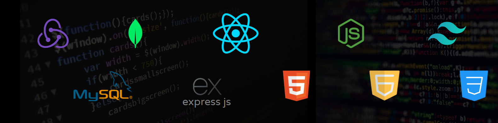

<h1 align="center"></h1>
<h3 align="center">A passionate frontend developer from India 
 </h3>

  

 

 

  

  

🏫 I’m currently learning **MERN Full Stack Development**

🔎 I’m actively looking to collaborate on **Open source Project**

👨‍💻 Explore my projects at [https://vipul-sharma.netlify.app/](https://vipul-sharma.netlify.app/)

📫 How to reach me **vipulsharma3001@gmail.com**

## 🔰 Let's Connect:

<h3 align="left">Languages and Tools:</h3>

              

&nbsp;

